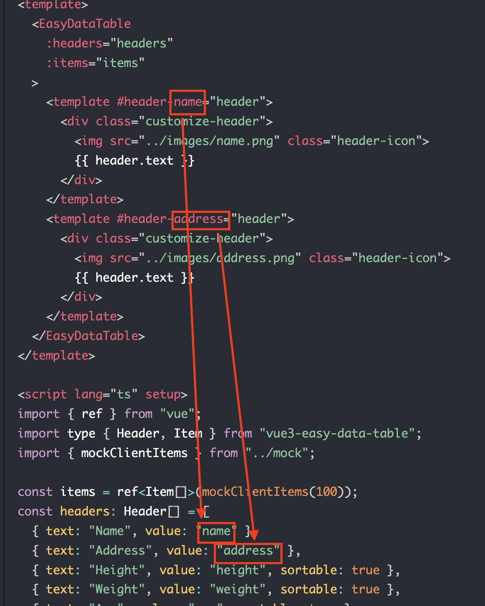

# Header slot
You can customize only certain column header by using slot `#header-{name}`:
> This is a new feature since version `1.2.25`

```vue
<template>
  <EasyDataTable
    :headers="headers"
    :items="items"
  >
    <template #header-name="header">
      <div class="customize-header">
        
        {{ header.text }}
      </div>
    </template>
    <template #header-address="header">
      <div class="customize-header">
        
        {{ header.text }}
      </div>
    </template>
  </EasyDataTable>
</template>

<script lang="ts" setup>
import { ref } from "vue";
import type { Header, Item } from "vue3-easy-data-table";
import { mockClientItems } from "../mock";

const items = ref<Item[]>(mockClientItems(100));
const headers: Header[] = [
  { text: "Name", value: "name" },
  { text: "Address", value: "address" },
  { text: "Height", value: "height", sortable: true },
  { text: "Weight", value: "weight", sortable: true },
  { text: "Age", value: "age", sortable: true },
  { text: "Favourite sport", value: "favouriteSport" },
  { text: "Favourite fruits", value: "favouriteFruits" },
];
</script>

<style>
.customize-header {
  display: flex;
  justify-items: center;
  align-items: center;
}
.header-icon {
  display: inline-block;
  width: 20px;
  height: 20px;
}
</style>
```

> :warning: **Attention**: the `{name}` of `#header-{name}` should be a value of header item:



## Example

<HeaderSlot/>

> :warning: `header slot` feature is based on the [`slots`](https://vuejs.org/guide/components/slots.html) feature of vue.js. So before using the `header slot` feature in vue3-easy-data-table, Please make sure you have known how to use the [`slots`](https://vuejs.org/guide/components/slots.html) feature of vue.js. 