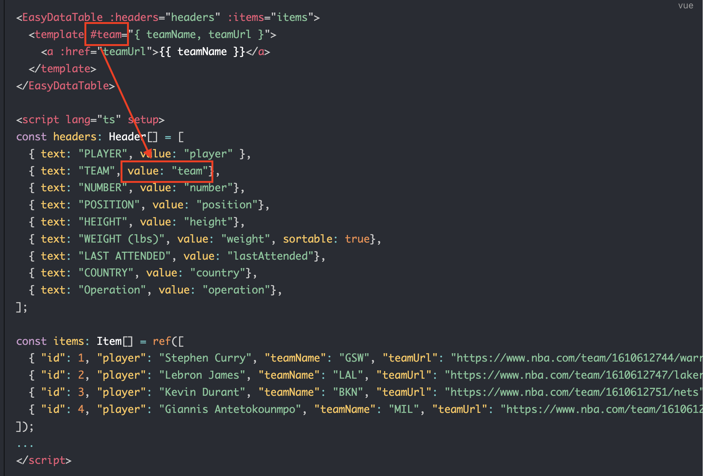

# Item slot
You can customize only certain columns item by using slot `#item-{name}`:

```vue
<EasyDataTable :headers="headers" :items="items">
  <template #item-team="{ teamName, teamUrl }">
    <a :href="teamUrl">{{ teamName }}</a>
  </template>
  <template #item-indicator.weight="item">
    {{ item.indicator.weight }} (lbs)
  </template>
</EasyDataTable>

<script lang="ts" setup>
import type { Header, Item } from "vue3-easy-data-table";

const headers: Header[] = [
  { text: "PLAYER", value: "player" },
  { text: "TEAM", value: "team"},
  { text: "NUMBER", value: "number"},
  { text: "POSITION", value: "position"},
  { text: "HEIGHT", value: "indicator.height"},
  { text: "WEIGHT", value: "indicator.weight", sortable: true},
  { text: "LAST ATTENDED", value: "lastAttended"},
  { text: "COUNTRY", value: "country"},
  { text: "Operation", value: "operation"},
];

const items: Item[] = [
    { "id": 1, "player": "Stephen Curry", "page": "https://www.nba.com/player/201939/stephen-curry", "avator": "https://bafkreih3oswhrhrvxwhebuqqnlqtklnth5pbc2q3iv6446icpltt6tymvy.ipfs.dweb.link/?filename=Stephen.png", "teamName": "GSW", "teamUrl": "https://www.nba.com/team/1610612744/warriors", "number": 30, "position": 'G', indicator: {"height": '6-2', "weight": 185}, "lastAttended": "Davidson", "country": "USA"},
    { "id": 2, "player": "Lebron James",  "page": "https://www.nba.com/player/2544/lebron-james", "avator": "https://bafkreigphmpdonfxpcb7lwrzv754t2xp2cw3segdpsj44rpurzwnuowhsq.ipfs.dweb.link/?filename=lebron.png", "teamName": "LAL", "teamUrl": "https://www.nba.com/team/1610612747/lakers", "number": 6, "position": 'F', indicator: {"height": '6-9', "weight": 250}, "lastAttended": "St. Vincent-St. Mary HS (OH)", "country": "USA"},
    { "id": 3, "player": "Kevin Durant", "page": "https://www.nba.com/player/201142/kevin-durant", "avator": "https://bafkreihvjvturzol7kfdafrnpxvilj2rti5bwyee7wbvtxogrx34uzjfz4.ipfs.dweb.link/?filename=Kevin.png", "teamName": "BKN", "teamUrl": "https://www.nba.com/team/1610612751/nets", "number": 7, "position": 'F', indicator: {"height": '6-10', "weight": 240}, "lastAttended": "Texas-Austin", "country": "USA"},
    { "id": 4, "player": "Giannis Antetokounmpo", "page": "https://www.nba.com/player/203507/giannis-antetokounmpo", "avator": "https://bafkreie26rcr5ppdpqrclr3kpk7p7hqyypjo3o2g43yk35ly4e5dmwxigm.ipfs.dweb.link/?filename=Giannis.png", "teamName": "MIL", "teamUrl": "https://www.nba.com/team/1610612749/bucks", "number": 34, "position": 'F', indicator: {"height": '6-11', "weight": 242}, "lastAttended": "Filathlitikos", "country": "Greece"},
  ];
...
</script>
```
> :warning: **Attention**: the `{name}` of `#item-{name}` should be a value of header item:



## Example

[](https://codesandbox.io/s/item-slot-65tc9v?file=/src/App.vue)

<ItemSlot/>

> :warning: `item slot` feature is based on the [`slots`](https://vuejs.org/guide/components/slots.html) feature of vue.js. So before using the `item slot` feature in vue3-easy-data-table, Please make sure you have known how to use the [`slots`](https://vuejs.org/guide/components/slots.html) feature of vue.js. 
