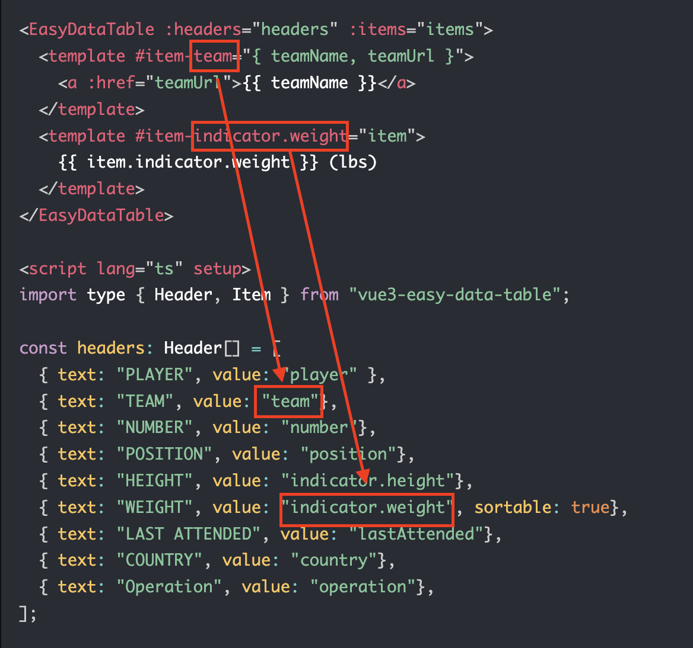

# Item slot
You can customize only certain columns like this:
```vue
<EasyDataTable :headers="headers" :items="items">
  <template #team="{ teamName, teamUrl }">
    <a :href="teamUrl">{{ teamName }}</a>
  </template>
</EasyDataTable>

<script lang="ts" setup>
import type { Header, Item } from "vue3-easy-data-table";

const headers: Header[] = [
  { text: "PLAYER", value: "player" },
  { text: "TEAM", value: "team"},
  { text: "NUMBER", value: "number"},
  { text: "POSITION", value: "position"},
  { text: "HEIGHT", value: "height"},
  { text: "WEIGHT (lbs)", value: "weight", sortable: true},
  { text: "LAST ATTENDED", value: "lastAttended"},
  { text: "COUNTRY", value: "country"},
  { text: "Operation", value: "operation"},
];

const items: Item[] = ref([
  { "id": 1, "player": "Stephen Curry", "teamName": "GSW", "teamUrl": "https://www.nba.com/team/1610612744/warriors", "number": 30, "position": 'G', "height": '6-2', "weight": 185, "lastAttended": "Davidson", "country": "USA"},
  { "id": 2, "player": "Lebron James", "teamName": "LAL", "teamUrl": "https://www.nba.com/team/1610612747/lakers", "number": 6, "position": 'F', "height": '6-9', "weight": 250, "lastAttended": "St. Vincent-St. Mary HS (OH)", "country": "USA"},
  { "id": 3, "player": "Kevin Durant", "teamName": "BKN", "teamUrl": "https://www.nba.com/team/1610612751/nets", "number": 7, "position": 'F', "height": '6-10', "weight": 240, "lastAttended": "Texas-Austin", "country": "USA"},
  { "id": 4, "player": "Giannis Antetokounmpo", "teamName": "MIL", "teamUrl": "https://www.nba.com/team/1610612749/bucks", "number": 34, "position": 'F', "height": '6-11', "weight": 242, "lastAttended": "Filathlitikos", "country": "Greece"},
]);
...
</script>
```
> :warning: **Attention**: the `<name>` of `#<name>` should be a value of header item:



## Example

[](https://codesandbox.io/s/item-slot-65tc9v?file=/src/App.vue)

<ItemSlot/>

